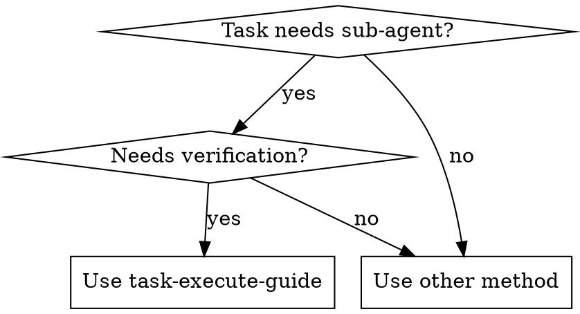

# Task Execute Guide

## Overview
Atomic workflow: sub-agent implements via goal, another verifies, retry on failure.

## When to Use
- Task can be implemented independently by sub-agent
- Need verification after implementation
- Want automatic retry (max 3) on failure

**When NOT to use:**
- Task needs human judgment at each step
- Task is trivial (can be done directly without sub-agent)
- No verification needed after implementation
- Task has sequential dependencies (cannot run independently)
- Urgent fix needed (no time for retry loop)



## Core Principles
1. **Minimal Knowledge**: Sub-agents receive only needed information
2. **Single Task Execution**: Only execute what is explicitly instructed
   - If tasked with 1.1, do NOT implement 1.2 even if related
   - Report after EACH task, wait for next instruction
3. **Sequential Execute**: implement → test → report
4. **Test Runs Once**: Testing sub-agent runs exactly once, no self-fix
5. **Automatic Retry**: Re-invoke implementation with failure reason
6. **Max 3 Retries**: Stop after 3 failed attempts
7. **Goal-Oriented**: Sub-agents receive goals (what), not methods (how)

## Core Pattern

### Before: Method-Oriented (Wrong)
```typescript
task(
  prompt: `
### Instruction
Rewrite this promise hell using async/await  ← Telling HOW

### Files
app.ts
`
)
```
**Problem:** Sub-agent doesn't reason about approach, just follows order blindly.

### After: Goal-Oriented (Correct)
```typescript
task(
  prompt: `
### Goal
Rewrite promise hell for maintainability  ← Telling WHAT only

### Files
app.ts

### Important
You MUST reason about implementation approach yourself
`
)
```
**Result:** Sub-agent evaluates options (async/await, async/await with error handling, etc.) and chooses best approach.

## Quick Reference
| Sub-Agent | Template File |
|-----------|---------------|
| Implementation | `templates/implementation.md` |
| Testing | `templates/testing.md` |
| Retry | `templates/retry.md` |

## Implementation
1. **Analyze Task**: Extract goal (NOT method)
2. **Execute**: See `templates/` for prompts
   - Implementation Sub-Agent: reads goal, reasons about approach
   - Testing Sub-Agent: reads verification goal, reasons about test method
   - Retry Flow: reads failure evidence, reasons about fix
3. **Report**: Output pass/fail + evidence

**Main Agent Constraints (CRITICAL):**
- MUST NOT directly modify files (use Implementation sub-agent only)
- MUST NOT directly write test scripts (use Testing sub-agent only)
- MUST NOT directly run tests (use Testing sub-agent only)
- ONLY: Invoke sub-agents, track retries, report results

**Test File Management:**
- MUST be named: `e2e/task-<N>-<desc>.spec.ts` (UI) or `test/task-<N>-<desc>.ts` (API)
- NEVER commit test files to git

## Common Mistakes
- Telling sub-agent HOW (e.g., "use async/await") → Give goal only
- Providing templates in prompt → Remove all templates
- Implementing multiple tasks at once (e.g., 1.1 AND 1.2) → Stick to single task, report after each

## Red Flags - STOP and Fix Prompt
- "I'll just tell it to use X method"
- Including code templates "for clarity"
- Goal field describes HOW instead of WHAT
- Test prompt contains example code
- "I'll just do 1.2 as well since it's related to 1.1"
- "It's more efficient to do both at once"
- "The user probably wants both done"

**All of these mean: You are ONLY authorized for the specific task numbered (e.g., 1.1). Report after completion.**


